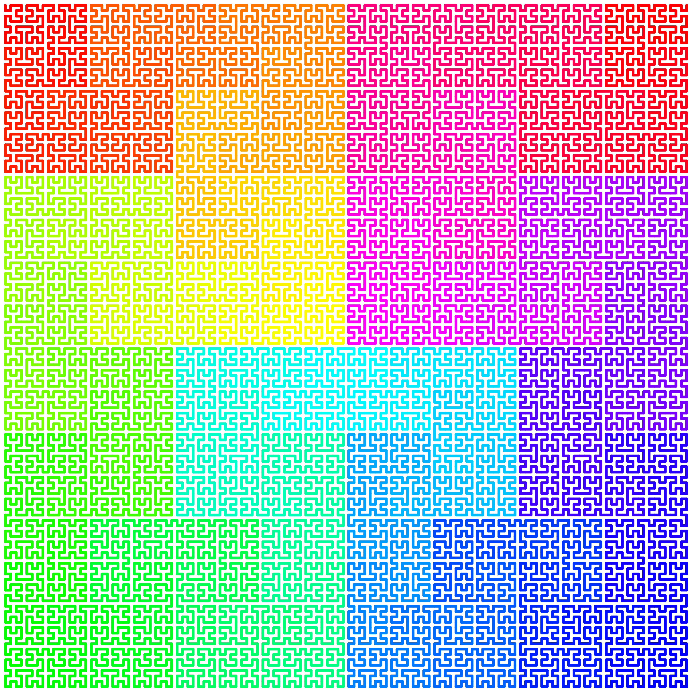

# Functional Hilbert
This is basic haskell realization of hilbert curve, using Diagrams package.
Has coloured and non coloured drawing function.

--to add animation - [just open pdf :)](https://github.com/kanashimia/Throw-Away-Projects/blob/master/FunctionalHilbert/h-anim.pdf)

### This is basically whole code for calculating hilbert curve:

```
hilbert :: Int -> Trail V2 Double
hilbert 0 = mempty
hilbert n = hilbert (n-1)  # rotateBy (1/4) # reflectY <> vrule 1
         <> hilbert (n-1) <> hrule 1
         <> hilbert (n-1) <> vrule (-1)
         <> hilbert (n-1)  # rotateBy (1/4) # reflectX
```
### This is whole coloured drawing:
```
drawHilbertColor n
    = frame 1
    $ mconcat
    $ zipWith lc =<< colors . length
    $ map (lineCap LineCapRound . strokeLocT)
    $ explodeTrail
    $ hilbert n `at` origin
  where
    colors n = cycle $ map makeColor [0,360 / realToFrac n..360]
    makeColor a = uncurryRGB sRGB $ hsv a 1 1
```

## Output


For other file formats check files named h.* in main repo folder


